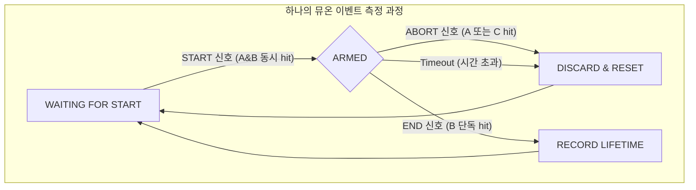

-----

# Notice TDC 4채널 DAQ 및 분석 프레임워크 (C++ 리팩토링 버전)

## 1\. 개요

이 프로젝트는 **NoticeKorea의 4채널 TDC 모듈**을 위한 데이터 획득(DAQ) 및 유지보수용 소프트웨어 프레임워크입니다. 기존의 C 기반 코드들을 **현대적인 C++17 스타일로 전면 리팩토링**하여 안정성, 유지보수성, 확장성을 크게 향상시켰습니다.

데이터는 분석에 용이한 **ROOT TTree 형식**으로 저장되며, 모든 프로그램은 **CMake**를 통해 체계적으로 빌드 및 관리됩니다.

### 1.1. 트리거 방식: Constant Fraction Discrimination (CFD)

본 TDC 모듈은 제조사 정보에 따라, 신호의 크기에 상관없이 일정한 타이밍 정보를 얻는 데 유리한 **CFD(Constant Fraction Discrimination)** 방식을 사용하여 이벤트를 트리거합니다. 이는 단순 전압 레벨을 비교하는 FADC의 LED(Leading Edge Discrimination) 방식과 구분되는 중요한 특징입니다. CFD 비율은 TDC 보드 스위치로 하드웨어 적으로 수정해야 합니다. CFD 문턱 값은 소프트웨어적으로 수정 가능합니다. 

### 1.2. 주요 구성 요소

  * **`frontend_tdc_mini`**: TDC 데이터를 수집하여 ROOT 파일로 저장하는 메인 DAQ 프로그램.
  * **`tdc_calibrator`**: TDC의 시간 측정 정확도를 보정하고 룩업 테이블(`*.lut`)을 생성하는 유틸리티.
  * **`tdc_viewer`**: 저장된 TTree 데이터를 시각화하고 기본 분석을 수행하는 프로그램.
  * **`measure_lifetime`**: **(분석 스크립트)** 원본(`raw`) 데이터를 읽어 뮤온 수명 측정 로직에 따라 유효한 이벤트의 수명(시간 차이)을 계산하고, 결과 TTree를 생성하는 핵심 분석 프로그램.
  * **`libTDC_CONTROLLER.a`**: TDC와의 TCP/IP 통신을 캡슐화한 핵심 C++ 정적 라이브러리.

-----

## 2\. 프로젝트 구조

```

TDC_Project/
├── CMakeLists.txt         # 메인 빌드 스크립트
├── README.md              # 본 문서
│
├── config/
│   └── setup.txt          # 채널별 Threshold, IP 설정 파일
│
├── lib/                   # 핵심 라이브러리 소스
│   └── TdcController.cpp/h
│
├── app/                   # 실행 프로그램 및 분석 스크립트 소스
├── frontend_tdc_mini.cpp
├── tdc_calibrator.cpp
├── tdc_viewer.cpp
└── measure_lifetime.cpp

```

## 2.1 3채널 뮤온 수명 측정 로직 (상태 머신)

본 프레임워크는 3개의 검출기 채널(CH1, CH2, CH3)을 사용하여 뮤온의 정지 및 붕괴 현상을 포착합니다. `measure_lifetime` 스크립트는 아래의 상태 머신 로직에 따라 유효한 이벤트만을 선별합니다.



### 1단계: 뮤온 정지 (Start)
뮤온이 상단(CH1)과 중간(CH2) 검출기는 통과하지만, 하단(CH3)은 통과하지 못할 때를 '뮤온이 중간 검출기에서 정지했다'고 판단합니다. 이 순간부터 수명 측정 타이머가 시작됩니다.

논리 조건: CH1 & CH2 & !CH3

상태 전환: WAITING_FOR_START → ARMED

### 2단계: 붕괴 대기 (Wait)
시스템은 이제 'ARMED' 상태가 되어 중간 검출기(CH2)에서 뮤온이 붕괴하여 내보내는 미쉘 전자(Michel electron) 신호를 기다립니다.

### 3단계: 측정 무효화 (Abort)
만약 붕괴 신호를 기다리는 동안 다른 입자가 들어와 상단(CH1)이나 하단(CH3) 검출기에서 신호가 발생하면, 현재 측정은 오염된 것으로 간주하여 폐기하고 다시 1단계로 돌아갑니다.

논리 조건: CH1 | CH3

상태 전환: ARMED → DISCARD & RESET

### 4단계: 붕괴 포착 (End)
마침내 정지해 있던 뮤온이 붕괴하면, 방출된 미쉘 전자가 중간(CH2) 검출기에서만 신호를 남깁니다. 이 순간 타이머를 멈추고, Start부터 End까지의 시간 차이를 유효한 뮤온 수명 데이터로 기록합니다.

논리 조건: !CH1 & CH2 & !CH3

상태 전환: ARMED → RECORD LIFETIME

-----

## 3\. 빌드 및 설치

### 3.1. 시스템 요구사항

  * **운영체제**: Linux
  * **빌드 도구**: `cmake` (v3.10 이상), `g++` (C++17 지원)
  * **필수 라이브러리**: `ROOT 6`

### 3.2. 빌드 절차

프로젝트 최상위 디렉토리에서 아래 명령어를 실행하여 모든 프로그램을 빌드합니다.

```bash
# 1. 빌드 디렉토리 생성 및 이동
mkdir -p build && cd build

# 2. CMake 실행하여 빌드 환경 구성
cmake ..

# 3. 컴파일
make
```

빌드가 성공하면 `build/bin` 디렉토리 내에 `frontend_tdc_mini`, `tdc_calibrator`, `tdc_viewer` 실행 파일이 생성됩니다.

-----

## 4\. 사용법

### 4.1. DAQ 설정 (`config/setup.txt`)

DAQ를 시작하기 전, `config/setup.txt` 파일을 수정하여 **TDC의 IP 주소**와 \*\*채널별 임계값(Threshold)\*\*을 설정합니다. (CFD 방식에서도 arming을 위한 임계값은 필요합니다.)

```text
# TDC Device IP Address
192.168.0.2

# Thresholds (1 ~ 255)
10   # CH1 
10   # CH2
10   # CH3
10   # CH4
```

### 4.2. 데이터 획득 (`frontend_tdc_mini`)

설정 파일을 읽어 DAQ를 수행하고, 데이터를 ROOT TTree 형식으로 저장합니다.

```bash
# 기본 사용법
# frontend_tdc_mini -c <설정파일> -o <출력파일.root> [-t <시간(초)>]
# -t 옵션을 생략하거나 0으로 설정하면 무한 실행 모드가 됩니다.

# 예시
frontend_tdc_mini -c config/setup.txt -o run01.root -t 60
```
장시간 DAQ 실행 시 주의사항
TDC 하드웨어는 시간 설정을 위한 내부 레지스터가 16비트이므로, -t 옵션으로 설정 가능한 최대 시간은 **65,535초(약 18.2시간)**입니다. 이보다 긴 시간을 설정하면 오버플로우가 발생하여 예상보다 훨씬 짧게 동작합니다.

장시간 실행을 위해서는 -t 0 (무한 실행 모드) 옵션과 외부 스크립트를 함께 사용하는 것을 권장합니다. (자세한 내용은 5절 참조)

### 4.3. 뮤온 수명 분석 (measure_lifetime)
frontend_tdc_mini로 생성한 원본 데이터를 입력받아, 뮤온 수명 측정 로직에 따라 유효한 이벤트의 시간차(수명)만을 추출하여 새로운 ROOT 파일을 생성합니다.

```Bash

# 기본 사용법
# measure_lifetime <입력.root> <출력.root> [-d <delay_ns>]

# -d <delay_ns> (선택사항): Decay Gate 시작 시간(단위: ns). 
# Start 신호 직후의 노이즈를 제거하기 위해, 여기서 설정한 시간 이후부터 End 신호를 탐색합니다.

# 예시: run01.root 파일을 분석. Start 신호 후 100ns 이후부터 End 신호를 찾음.
measure_lifetime data/run01.root results/lifetime_100ns.root -d 100
```
분석이 완료되면 results/lifetime_100ns.root 파일에 lifetime_ps 브랜치를 가진 TTree가 생성되며, 이를 히스토그램으로 그려 뮤온의 평균 수명을 계산할 수 있습니다.


### 4.4. 데이터 시각화 (`tdc_viewer`)

획득한 `.root` 파일을 열어 기본적인 분석 결과를 확인합니다.

```bash
# 사용법
tdc_viewer <입력파일.root>

# 예시
tdc_viewer run01.root
```

프로그램을 실행하면 채널별 Hit 분포, TDC 스펙트럼, CH1-CH2 시간차 분포 등을 담은 캔버스가 나타납니다.

### 4.5. TDC 캘리브레이션 (`tdc_calibrator`)

TDC의 비선형성을 보정하기 위한 룩업 테이블(`.lut`)을 생성합니다.

**준비사항**: 캘리브레이션할 각 채널에 **무작위(random) 신호**를 인가해야 합니다.

```bash
# 사용법
tdc_calibrator <IP주소> <출력파일.lut>

# 예시
tdc_calibrator 192.168.0.2 tdc_cal.lut
```

프로그램의 안내에 따라 CH1부터 CH4까지 순서대로 신호를 연결하며 캘리브레이션을 진행합니다.

## 5. 고급 활용: 자동화된 장시간 DAQ
run_daq_long.sh 와 같은 쉘 스크립트를 사용하여 DAQ를 원하는 시간만큼 실행하고 자동으로 종료시킬 수 있습니다. 이는 TDC 하드웨어의 시간 설정 제약을 우회하는 가장 효과적인 방법입니다.
```bash
#!/bin/bash
# run_daq_long.sh

# 원하는 DAQ 시간 (초 단위)
# 예: 24시간 = 24 * 3600 = 86400초
ACQ_TIME_SEC=86400

# DAQ 프로그램을 무한 실행 모드(-t 0)로 백그라운드에서 시작
frontend_tdc_mini -c config/setup.txt -o data/run_24h.root -t 0 &

# DAQ 프로세스의 ID(PID) 저장
DAQ_PID=$!
echo "DAQ process started with PID: ${DAQ_PID}"

# 원하는 시간만큼 대기
sleep ${ACQ_TIME_SEC}

# 대기가 끝나면 Ctrl+C 신호(SIGINT)를 보내 안전하게 종료
echo "Time limit reached. Sending shutdown signal to PID ${DAQ_PID}..."
kill -INT $DAQ_PID

echo "Done."
```
